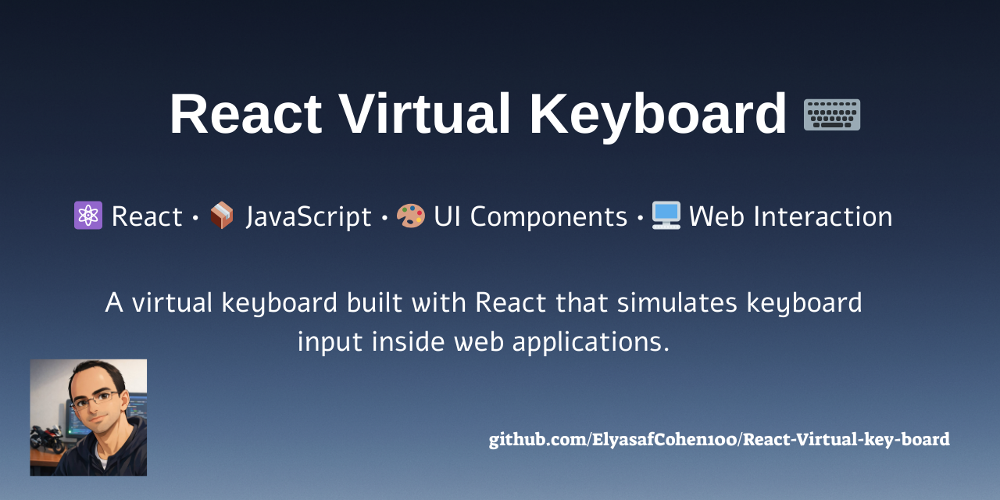

<p align="center">
  
</p>


# ⌨️ React Virtual Keyboard ⌨️


> 💻 **React UI Project**
> A virtual keyboard built with React that allows users to type text directly on screen using clickable keys.

---

## 🚀 Overview

This project demonstrates how to build an **interactive virtual keyboard interface** using **React**.

The application simulates a keyboard layout and allows users to input text by clicking keys on the screen.
It focuses on **component-based UI design**, **event handling**, and **state management** in React.

---

## 🏷️ Technologies


---

## ✨ Features

* ⌨️ Interactive on-screen keyboard
* 🧠 Built using React components
* ⚡ Fast development environment using **Vite**
* 🎨 Styled keyboard layout using CSS
* 🖱️ Clickable keys that simulate typing

---

## 📸 Preview

<p align="center">

</p>

> *(Add your screenshot here after running the project)*

---

## 🛠 Installation

Clone the repository:

```bash
git clone https://github.com/ElyasafCohen100/React-Virtual-key-board.git
```

Navigate into the project folder:

```bash
cd React-Virtual-key-board
```

Install dependencies:

```bash
npm install
```

Start the development server:

```bash
npm run dev
```

Open your browser and visit:

```text
http://localhost:5173
```

---

## 📂 Project Structure

```
React-Virtual-key-board
│
├── public
├── src
│   ├── components
│   ├── App.jsx
│   └── main.jsx
│
├── index.html
├── vite.config.js
└── package.json
```

---

## 📚 Learning Goals 📚

This project focuses on practicing:

* React component architecture
* Event handling in React
* Managing UI state
* Building interactive interfaces

---


---

⭐ If you found this project interesting, feel free to star the repository!
